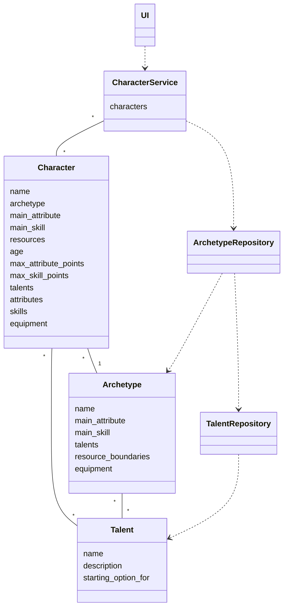

# Arkkitehtuurikuvaus

## Ohjelman rakenne

Ohjelman rakennetta kuvaava luokkakaavio on seuraava:

Kaaviossa on muutamia ominaisuuksia, joita ei ohjelman perusversiossa ole:
- Perusversiossa hahmolla voi olla vain yksi hahmon arkkityypille sopiva aloituslahjakkuus (Talent)
- Lahjakkuudet tallennetaan listaan, mutta tällä hetkellä lista tyhjennetään ennen uuden lahjakkuuden lisäämistä
- Toistaiseksi CharacterService tallentaa ja käsittelee vain yhtä Character-luokan oliota