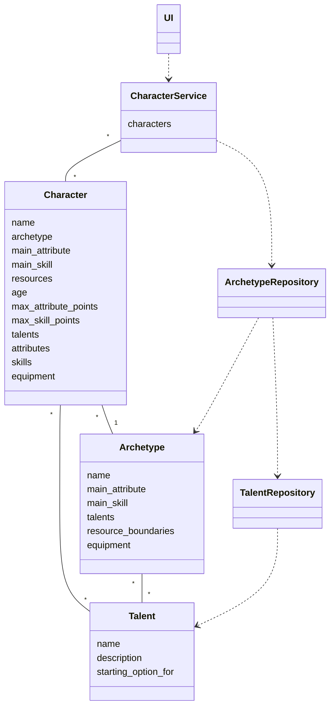
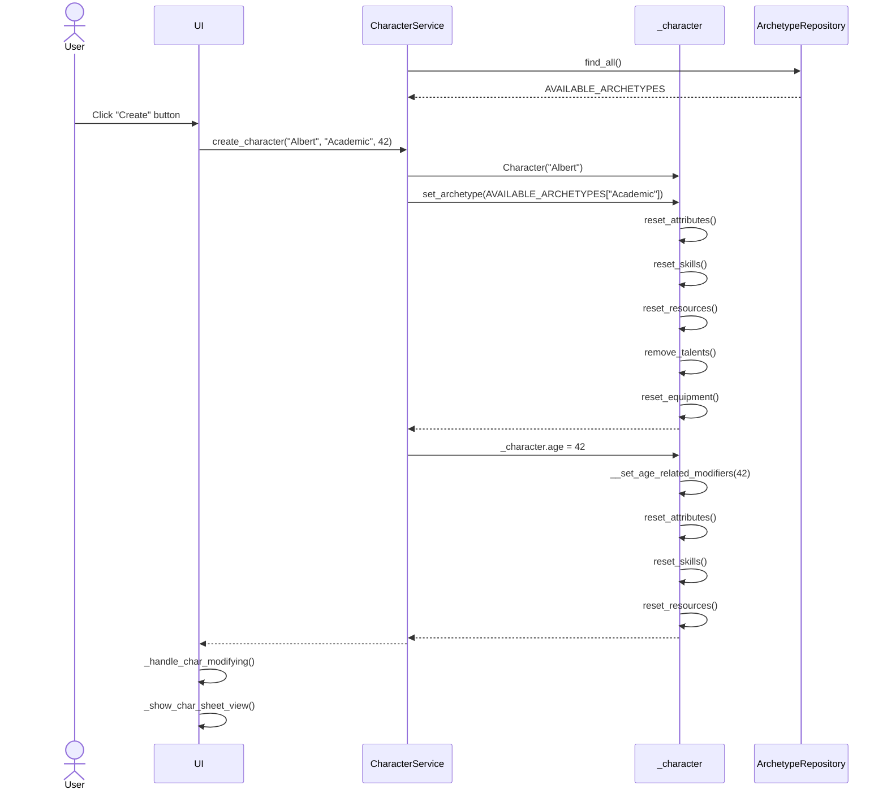

# Arkkitehtuurikuvaus

## Ohjelman rakenne

Ohjelman rakennetta kuvaava luokkakaavio on seuraava:

Kaaviossa on muutamia ominaisuuksia, joita ei ohjelman perusversiossa ole:
- Perusversiossa hahmolla voi olla vain yksi hahmon arkkityypille sopiva aloituslahjakkuus (Talent)
    - Lahjakkuudet tallennetaan listaan, mutta tällä hetkellä lista tyhjennetään ennen uuden lahjakkuuden lisäämistä
- Toistaiseksi CharacterService tallentaa ja käsittelee vain yhtä Character-luokan oliota

## Päätoiminnallisuuksia

### Uuden hahmon luominen

Kun käyttäjä on valinnut sovelluksen yläpalkista "Create new character" ja täyttänyt aukeavan näkymän ensimmäiseen kenttään hahmon nimen, valinnut pudotusvalikosta hahmolleen arkkityypin, valinnut sopivan iän hahmolle askelluskentään (spinbox) ja painanut "Create"-painiketta, niin sovelluksen kontrolli etenee seuraavasti:

`CharacterService` on hakenut sanakirjan tarjolla olevista arkkityypeistä ennen hahmonluontitapahtumaa. Napin painalluksen jälkeen tapahtumakäsittelijä kutsuu `CharacterService`-olion metodia `create_character`, jonka parametreina on hahmon nimi ja arkkityyppi merkkijonoina ja ikä kokonaislukuna. `CharacterService` luo uuden `Character`-olion, jonka name-attribuutiksi tulee hahmon nimi. Seuraavaksi `CharacterService` kutsuu `Character`-olion metodia `set_archetype`, jonka parametrina on `CharacterService`-olion tallentamasta sanakirjasta haettu sopiva `Archetype`-luokan olio. Kutsun seurauksena `Character`-olio palauttaa hahmon attribuuttien, taitojen, resurssien, lahjakkuuksien ja varusteiden arvot oletusarvoiksi, koska samalla metodikutsulla tapahtuu myös arkkityypin vaihtaminen ja eri arkkityypeillä on erilaiset vaihtoehdot edellä mainituille arvoille. Viimeisenä toimenpiteenä `CharacterService` asettaa `Character`-olion age-attribuutille uuden arvon, minkä seurauksena `Character`-olio asettaa ensin sisäisen metodinsa avulla uudet arvot attribuutti- ja taitopisteiden maksimimääriä kuvaaville muuttujille ja palauttaa attribuuttien, taitojen ja resurssien arvot oletusarvoiksi, koska hahmon ikä vaikuttaa näihin arvoihin ja samalla metodilla tapahtuu hahmon iän vaihtaminen. Lopuksi käyttöliittymä kutsuu metodeja, joiden suorittaminen päivittää käyttöliittymän näyttämään hahmon yksityiskohtaiseen muokkaamiseen käytettävää näkymää.