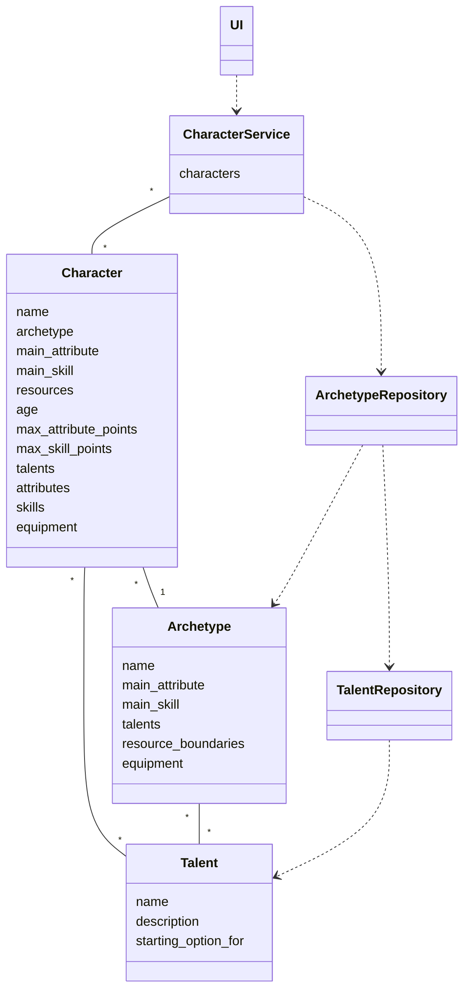
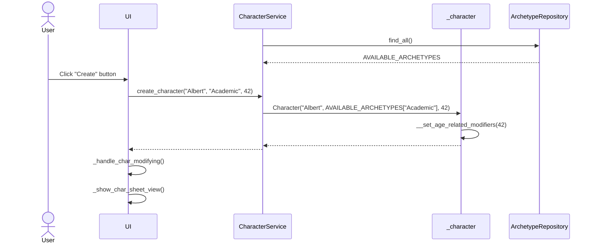

# Arkkitehtuurikuvaus

## Rakenne

Ohjelman rakennetta kuvaava luokkakaavio on seuraava:

Kaaviossa on muutamia ominaisuuksia, joita ei ohjelman perusversiossa ole:
- Perusversiossa hahmolla voi olla vain yksi hahmon arkkityypille sopiva aloituslahjakkuus (Talent)
    - Lahjakkuudet tallennetaan listaan, mutta tällä hetkellä lista tyhjennetään ennen uuden lahjakkuuden lisäämistä
- Toistaiseksi CharacterService tallentaa ja käsittelee vain yhtä Character-luokan oliota

## Käyttöliittymä

Sovelluksen käyttöliittymä koostuu kolmesta eri näkymästä:
- Aloitusnäyttö
- Uuden hahmon luomisen näkymä
- Hahmon muokkauksen näkymä

Näkymät on toteutettu omina luokkinaan, minkä lisäksi hahmon muokkauksen näkymä on jaettu neljään alikomponenttiin. UI-luokka vastaa näkymien näyttämisestä ja näkymien välillä siirtymisen mahdollistavan yläpalkin hallinnasta (uuden hahmon luomisesta kuitenkin siirrytään hahmon muokkaukseen näkymästä löytyvällä painikkeella). Käyttöliittymässä olevat muuttujat säilyttävät vain näkymälle tarpeellista tietoa ja käyttöliittymän takaisinkutsufunktiot hakevat tarvittavat tiedot `CharacterService`-luokan metodeja kutsumalla.

## Tietojen pysyväistallennus

Sovelluksen _repositories_ pakkauksen luokat `ArchetypeRepository`, `TalentRepository` ja `CharacterRepository` huolehtivat tietojen lataamisesta tiedostoista ja tietojen tallentamisesta tiedostoihin.

### Tiedostot

Sovellus tallentaa tietoja kahdessa eri tiedostomuodossa: teksti- ja JSON-tiedostoina. Ohjelman käynnistyksen yhteydessä `TalentRepository` ja `ArchetypeRepository` luokat lataavat hahmonluonnissa tarjolla olevat lahjakkuus- ja arkkityyppivaihtoehdot JSON-tiedostoista, joiden nimet määrittelee sovelluksen juuresta löytyvä .env-tiedosto. Tiedostoihin on mahdollista lisätä uusia lahjakkuus- ja arkkityyppivaihtoehtoja, kunhan jokaista lisättyä arkkityyppiä kohti lisätään kolme sille kuuluvaa aloituslahjakkuusvaihtoehtoa.

Lahjakkuustiedosto noudattaa seuraavaa formaattia:
```
[
    {
        "name": "Bookworm",                 # Nimi
        "description": "Gain +2 to...",     # Kuvaus
        "startingOptionFor": "Academic"     # Arkkityyppi, jolle kyky on valittavissa aloituskyvyksi
    },
    #Seuraava lahjakkuus
```

Arkkityyppitiedosto noudattaa seuraavaa formaattia:
```
[
    {
        "name": "Academic",                 # Nimi
        "mainAttribute": "Logic",           # Pääattributti
        "mainSkill": "Learning",            # Päätaito
        "talents": [                        # Lista lahjakkuuksien nimistä (lista on kolmen alkion mittainen)
            "Bookworm",                         # Vastaavat erikoiskyvyt on lisättävä myös lahjakkuustiedostoon!
            "Erudite",
            "Knowledge is Reassuring"
        ],
        "resourcesLowerBoundary": 4,        # Matalin aloitusresurssien määrä, oletusresurssit ilman taitopisteiden käyttöä
        "resourcesUpperBoundary": 6,        # Korkein aloitusresurssien määrä alussa
        "equipment": [                      # Lista varusteista, jotka hahmo voi saada (lista on kolmen alkion mittainen)
            ["book collection", "map book"],    # Tupleina kaksi toisensa pois sulkevaa vaihtoehtoa
            "writing utensils",                 # Merkkijonona varusteet, jotka arkkityyppi antaa suoraan
            ["liquor", "slide rule"]
        ]
    },
    #Seuraava arkkityyppi
]
```

Hahmojen käsittelystä huolehtiva `CharacterRepository`-luokka käsittelee sekä JSON- että tekstitiedostoja. Luokka käyttää hahmojen tallentamiseen ja lataamiseen JSON-tiedostoja, jotka noudattavat seuraavaa formaattia:
```
{
    "name": "Albert Brugge",
    "archetype": "Academic",
    "age": 42,
    "talents": [
        "Bookworm"
    ],
    "attributes": {
        "Physique": 2,
        "Precision": 3,
        "Logic": 5,
        "Empathy": 4
    },
    "skills": {
        "Agility": 1,
        "Close combat": 0,
        "Force": 0,
        "Medicine": 1,
        "Ranged combat": 0,
        "Stealth": 0,
        "Investigation": 2,
        "Learning": 3,
        "Vigilance": 1,
        "Inspiration": 1,
        "Manipulation": 1,
        "Observation": 1
    },
    "equipment": [
        "book collection",
        "writing utensils",
        "liquor"
    ],
    "resources": 5,
    "description": "Brief summary of e.g. character motivation, dark secret and relationships."
}
```

Luokka voi viedä hahmot tekstitiedostoihin, jotka voi tulostaa ja/tai joista tiedot on manuaalisesti kopioitavissa viralliselle hahmolomakkeelle. Tiedosto näyttää seuraavalta:
```
Albert Brugge, 42 (Middle aged)
Academic

Talents:
Bookworm: Gain +2 to...

Attributes:
Physique       2
Precision      3
Logic          5 (Main)
Empathy        4

Skills:
Agility        1
Close combat   0
Force          0
Medicine       1
Ranged combat  0
Stealth        0
Investigation  2
Learning       3 (Main)
Vigilance      1
Inspiration    1
Manipulation   1
Observation    1

Equipment:
- book collection
- writing utensils
- liquor

Attribute points left: 0
Skill/resource points left: 0

Resources: 5

Character description:
Brief summary of e.g. character motivation, dark secret and relationships.

```

## Päätoiminnallisuuksia

### Uuden hahmon luominen

Kun käyttäjä on valinnut sovelluksen yläpalkista "Create new character" ja täyttänyt aukeavan näkymän ensimmäiseen kenttään hahmon nimen, valinnut pudotusvalikosta hahmolleen arkkityypin, valinnut sopivan iän hahmolle askelluskentään (spinbox) ja painanut "Create"-painiketta, niin sovelluksen kontrolli etenee seuraavasti:



`CharacterService` on hakenut sanakirjan tarjolla olevista arkkityypeistä ennen hahmonluontitapahtumaa. Napin painalluksen jälkeen tapahtumakäsittelijä kutsuu `CharacterService`-olion metodia `create_character`, jonka parametreina on hahmon nimi ja arkkityyppi merkkijonoina ja ikä kokonaislukuna. `CharacterService` luo uuden `Character`-olion, jonka name-attribuutiksi tulee hahmon nimi, archetype-attribuutiksi `CharacterService`-olion tallentamasta sanakirjasta haettu sopiva `Archetype`-luokan olio ja age-attribuutiksi hahmon ikä. Kutsun seurauksena `Character`-olio asettaa annetut arvot sopiviin muuttujiin, asettaa hahmon arkkityyppiin liittyvät arvot `Archetype`-olion perusteella sopiviksi, pohjustaa hahmon kyky- ja varustetaulukot ja attributti- ja taitosanakirjat ja asettaa sisäisen metodinsa avulla arvot attribuutti- ja taitopisteiden maksimimääriä kuvaaville muuttujille, koska hahmon ikä vaikuttaa näihin arvoihin. Lopuksi käyttöliittymä kutsuu metodeja, joiden suorittaminen päivittää käyttöliittymän näyttämään hahmon yksityiskohtaiseen muokkaamiseen käytettävää näkymää.

## Ohjelman rakenteeseen jääneet heikkoudet

### Käyttöliittymä
Ohjelmasta puuttuu virheiden käsittely ja sitä kautta virheilmoitukset tilanteissa, joissa käyttäjä on tehnyt vääränlaisia muutoksia arkkityyppien ja lahjakkuuksien tallentamiseen käytettyihin tiedostoihin.

### Sovelluslogiikka
Työnjako _entities_-pakkauksen `Character`-luokan, _services_-pakkauksen `CharacterService`-luokan ja _repositories_-pakkauksen `CharacterRepository`-luokan välillä vaatii selkeyttämistä, ainakin hahmojen tietojen käsittelyyn käytettäviä metodeja on siirrettävä `Character`-luokasta kahden muun luokan vastuulle.