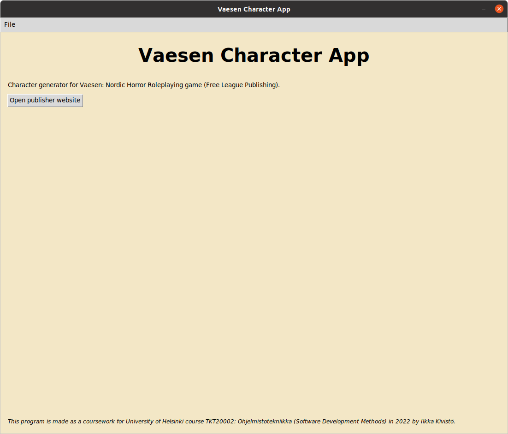
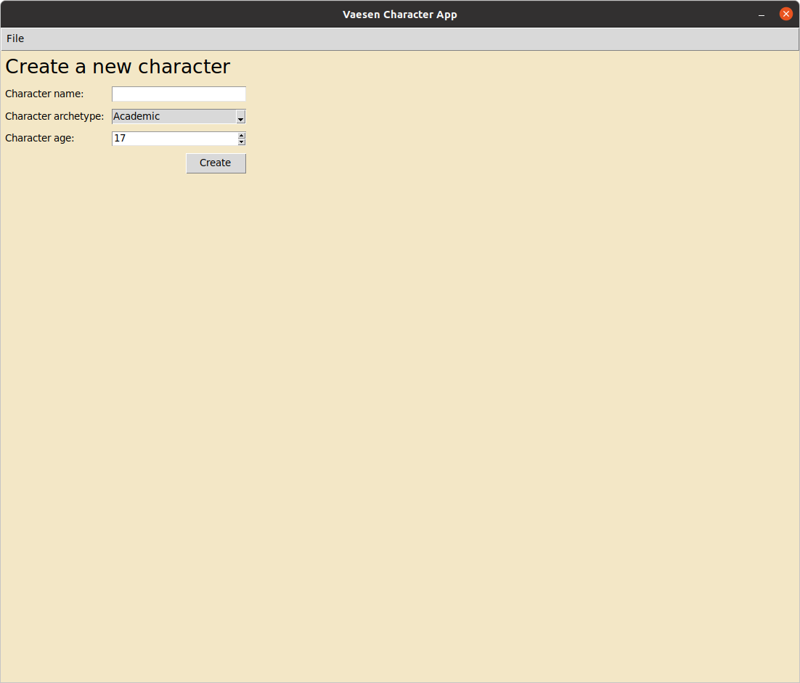

# Käyttöohje

Sovelluksen viimeisin [release](https://github.com/kivistoilkka/ot-harjoitustyo/releases) on ladattavissa _Releases_-sivun _Assets_-osiosta pakattuna joko zip tai tar.gz muodossa.

## Python-versio ja Poetry

Sovellus on kirjoitettu ja sen toiminta on testattu Pythonin versiolla 3.8 ja sen riippuvuuksien hallinta on toteutettu Poetry-työkalun avulla. Ohjeita [Python-versioiden](https://ohjelmistotekniikka-hy.github.io/python/toteutus#python-versioiden-hallinta) ja [Poetryn](https://ohjelmistotekniikka-hy.github.io/python/viikko2#poetry-ja-riippuvuuksien-hallinta) asentamiseen löytyy muun muassa Helsingin yliopiston [Ohjelmistotekniikan](https://ohjelmistotekniikka-hy.github.io/) kurssin kurssimateriaalista.

## Sovelluksen käynnistäminen

Purettuasi sovelluksen viimeisimmän version haluamaasi kansioon, asenna riippuvuudet komentorivillä komennolla:

```bash
poetry install
```

Tämän jälkeen sovellus käynnistyy komennolla:

```bash
poetry run invoke start
```

Sovellus käynnistyy aloitusnäkymään:



Sovelluksesta voi poistua valitsemalla ylävalikosta "File" -> "Exit".

## Uuden hahmon luominen

Uuden hahmon luominen tapahtuu valitsemalla yläpalkin valikosta File -> Create new character, jolloin siirrytään hahmonluontinäkymään:



Hahmolle on annettava nimi ja ikä (vähintään 17). Lisäksi hahmolle valitaan arkkityyppi valikossa tarjotuista vaihtoehdoista. "Create"-painikkeella siirrytään hahmolomakenäkymään, jossa hahmolle voi antaa tarkempia tietoja.

## Hahmon muokkaaminen

Hahmon luomisen jälkeen avautuu hahmolomakenäkymä:


Näkymässä on seuraavanlaiset toiminnallisuudet:
- Hahmon nimen voi vaihtaa kirjoittamalla kenttään uuden nimen ja painamalla "Change name"-painiketta.
- Hahmon iän ja/tai arkkityypin voi vaihtaa valitsemalla näiden kenttiin uudet arvot ja painamalla "Update"-painiketta.
 - HUOM! Näiden arvojen päivittäminen palauttaa hahmon attribuuttit, resurssit ja kyvyt oletusarvoihin, poistaa hahmon lahjakkuuden ja asettaa varusteet valittuna olevan arkkityypin oletusarvoiksi.
- Hahmolle voi kirjoittaa vapaamuotoisen kuvauksen tekstikenttään ja kuvaus lisätään hahmon kuvaukseksi painamalla "Update"-painiketta.
- Hahmon attribuuttien arvoja voi muuttaa attribuuttien nimien vieressä olevilla "-" ja "+" -painikkeilla. Korostettu attribuutti on valitun arkkityypin pääattribuutti, joka voi olla väliltä 2-5, kun loput kolme attribuuttia voivat olla väliltä 2-4. Painikkeiden alla näytetään jäljellä olevat attribuuttipisteet.
- Hahmon resursseja voi vaihtaa sille osoitetuilla "-" ja "+" -painikkeilla. Näiden ala- ja ylärajat määräytyvät valitun arkkityypin mukaan. Resurssien kasvattamiseen käytetään kykypisteitä, joiden jäljellä olevan määrä näkyy näkymän alalaidassa.
- Hahmon kykyjen arvoja voi muuttaa kykyjen nimien vieressä olevilla "-" ja "+" -painikkeilla. Korostettu kyky on valitun arkkityypin pääkyky, jonka arvo voi olla väliltä 0-3, kun loppujen kykyjen arvot voivat olla väliltä 0-2. Painikkeiden alla näytetään jäljellä olevat kykypisteet.
- Hahmon lahjakkuuden voi valita näkymän oikean yläkulman valikosta. Hahmolle ei ole valittu oletusarvoista kykyä.
- Osan hahmon varusteista voi valita kahden vaihtoehdon väliltä. Valinnat päivittyvät painamalla "Change equipment"-painiketta, jolloin painikkeen alla oleva varustelista päivittyy näyttämään hahmon tämänhetkisiä varusteita.

Näkymästä voi poistua aloitusnäkymään valitsemalla ylävalikosta "File" -> "Close current character".
- HUOM! Sovellus ei varmista hahmon tallentamista ennen hahmolomakenäkymästä poistumista, joten jos sen haluaa säilyttää, niin se tulee tallentaa tai viedä tiedostoon ennen näkymästä poistumista.

## Hahmon tallentaminen tiedostoon

Hahmon tallentaminen onnistuu valitsemalla hahmolomakenäkymässä ylävalikosta "File" -> "Save character as...". Avautuvassa tiedostoselaimessa hahmotiedostolle valitaan nimi ja sijoituskansio.

## Hahmon avaaminen tiedostosta

Missä tahansa näkymässä voi valita ylävalikosta "File" -> "Open existing character". Avautuvasta tiedostoselaimesta valitaan aiemmin luodun hahmon JSON-tiedosto (.json). Jos hahmotiedosto on kunnossa, niin hahmolomakenäkymä avautuu avatun hahmon tiedoilla.

## Hahmon vieminen tekstitiedostoon

Hahmon voi viedä tekstitiedostoon esimerkiksi tulostamista varten valitsemalla hahmolomakenäkymässä ylävalikosta "File" -> "Export to text file". Avautuvassa tiedostoselaimessa tekstitiedostolle valitaan nimi ja sijoituskansio.

## Konfigurointi

Sovelluksen tarjoamat arkkityyppi- ja lahjakkuusvaihtoehdot on tallennettu erillisiin tiedostoihin _data_-hakemistossa (_archetypes.json_ ja _talents.json_). Tiedostoihin voi lisätä lisää vaihtoehtoja tai uusille tiedostoille voi määritellä uudet nimet _.env_-tiedostossa, jonka muoto on seuraava:

```
TALENTS_FILENAME=talents.json
ARCHETYPES_FILENAME=archetypes.json
```

### Uusien arkkityyppi- ja erikoistaitovaihtoehtojen lisääminen

Arkkityyppitiedostoon (oletusarvoisesti _archetypes.json_) on tallennettu kaikki tarjolla olevat arkkityyppivaihtoehdot ja käyttäjä voi vapaasti lisätä omia arkkityyppivaihtoehtoja. Tiedosto noudattaa seuraavaa formaattia:

```
[
    {
        "name": "Academic",                 # Nimi
        "mainAttribute": "Logic",           # Pääattributti
        "mainSkill": "Learning",            # Pääkyky
        "talents": [                        # Lista lahjakkuuksien nimistä (lista on kolmen alkion mittainen)
            "Bookworm",                         # Vastaavat lahjakkuudet on lisättävä myös lahjakkuustiedostoon!
            "Erudite",
            "Knowledge is Reassuring"
        ],
        "resourcesLowerBoundary": 4,        # Matalin aloitusresurssien määrä, oletusresurssit ilman taitopisteiden käyttöä
        "resourcesUpperBoundary": 6,        # Korkein aloitusresurssien määrä alussa
        "equipment": [                      # Lista varusteista, jotka hahmo voi saada (lista on kolmen alkion mittainen)
            ["book collection", "map book"],    # Tupleina kaksi toisensa pois sulkevaa vaihtoehtoa
            "writing utensils",                 # Merkkijonona varusteet, jotka arkkityyppi antaa suoraan
            ["liquor", "slide rule"]
        ]
    },
    #Seuraava arkkityyppi
]
```

Lahjakkuustiedostoon (oletusarvoisesti _talents.json_) on puolestaan tallennettu kaikki tarjolla olevat lahjakkuusvaihtoehdot. Kullekin arkkityypille on pelin alussa tarjolla kolme lahjakkuusvaihtoehtoa, joten uuden arkkityypin lisäämisen yhteydessä siihen liittyvät lahjakkuudet tulee lisätä tähän tiedostoon. Tiedosto noudattaa vastaavasti seuraavaa formaattia:

```
[
    {
        "name": "Bookworm",                 # Nimi
        "description": "Gain +2 to...",     # Kuvaus
        "startingOptionFor": "Academic"     # Arkkityyppi, jolle kyky on valittavissa aloituslahjakkuudeksi
    },
    #Seuraava erikoiskyky
```

Molempia tiedostoja muokattaessa tulee huomata, että listan viimeisen alkion jälkeen ei saa lisätä pilkkua, muuten sovellus yrittää ladata olematonta dataa tiedostosta ja antaa _JSONDecodeError_:n.