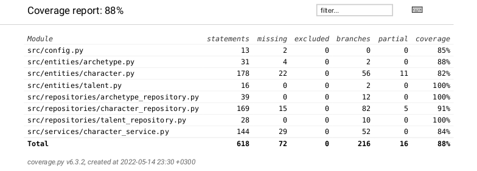

# Testausdokumentti

Sovellusta on yksikkötestattu ohjelmallisesti unittest-sovelluskehyksen avulla. Integraatiotestausta on suoritettu samalla sovelluskehyksellä jossain määrin, pääasiassa repository-luokkien välillä, CharacterService-luokan olion hakiessa saatavilla olevat arkkityypit ArchetypeRepository-luokan oliolta ja useiden luokkien käyttäessä Entities-paketin olioiden metodeja. Järjestelmätason testit on tehty manuaalisesti.

## Yksikkö- ja integraatiotestaus

Useissa testeissä hyödynnettyjä tietorakenteita ja olioita tuottavia metodeja on tallennettu TestHelper-luokkaan.

### Sovelluslogiikka

Sovelluslogiikasta vastaavan `CharacterService`-luokan testaus on toteutettu `CharacterService`-testiluokalla. Luokka on toteutettu niin, että sille voidaan injektoida riippuvuudeksi repositorio-olio, mutta repositorioluokkien kutsumiselle ei ole kirjoitettu testejä.

### Repositorio-luokat

Repositorioluokista `ArchetypeRepository` ja `TalentRepository` ovat toiminnaltaan hyvin yksinkertaisia, joten niiden täysi testikattavuus on saavutettu muutamalla testillä `TestArchetypeRepository`- ja `TestTalentRepository`-testiluokissa. Niiden testaamiseen on käytetty _.env.test_-tiedostossa määriteltyjä testitiedostoja, jotka on tallennettu samaan _data_-kansioon sovelluksessa käytettyjen varsinaisten tiedostojen kanssa.

`CharacterRepository`-luokkaa on testattu `TestCharacterRepository`-testiluokalla, jonka käyttämät väärin formatoidut tai Vaesen-pelin sääntöjä noudattamattomat hahmotiedostot on tallennettu testien yhteydestä löytyvään _test_characters_-kansioon.

### Testauskattavuus

Sovelluksen testauksen haarautumakattavuus on 88%, minkä lisäksi kaikkein luokkien testien haarautumakattavuus on vähintään 82%. Käyttöliittymä jätettiin testien ulkopuolelle.

## Järjestelmätestaus

Sovelluksen järjestelmätason testaus on tehty manuaalisesti.

### Asennus ja konfigurointi

Sovellus on haettu ja asennettu käyttöohjeen mukaisesti. Konfiguroinnista on testattu arkkityyppi- ja lahjakkuustiedostojen muokkaamista ja näiden tiedostojen vaihtamista toisiksi _env._-tiedoston kautta.

### Toiminnallisuudet

Kaikki vaatimusmäärittelyssä luetellut toiminnallisuudet on käyty läpi, minkä lisäksi virheellisten syötteiden antamista on testattu.

## Sovellukseen jääneet laatuongelmat

Sovellukseen on jäänyt seuraavia kehityskohtia:

- Ohjelman toimintaa tällaisissa tilanteissa ei ole testattu tilanteissa, joissa käyttäjä on lisännyt väärin muotoiltuja arkkityyppi- ja erikoistaitoja JSON-tiedostoihin. Sovelluksesta puuttuu myös näihin tilanteisiin liittyvät virheilmoitukset.
- `CharacterService`-luokan kaikille metodeille pitäisi kirjoittaa testit, jonka jälkeen `Character`-luokan sovelluslogiikkaa olisi helpompi siirtää `CharacterService`- ja `CharacterRepository`-luokille.
- Kaikki hahmon käsittelyyn liittyvät luokat, eli `Character`, `CharacterService` ja `CharacterRepository`, sisältävät paljon attribuutteja ja/tai metodeja. Lähes täydellisellä testikattavuudella sovelluksen refaktorointi pienempiin yksiköihin olisi mahdollista tehdä ilman riskiä sovelluksen hajoamisesta.