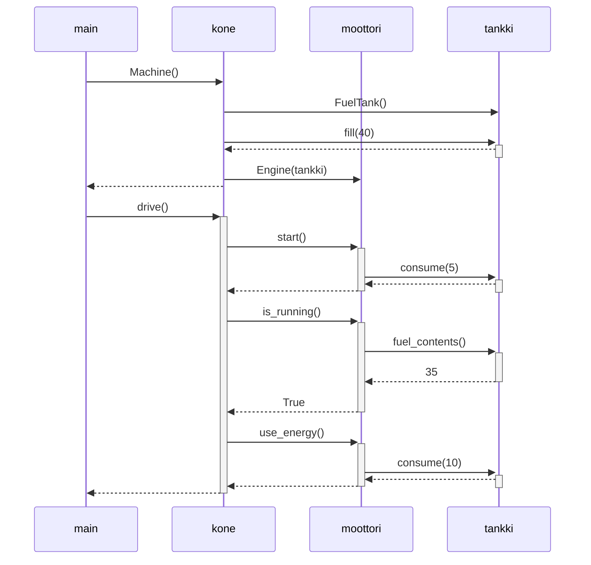

```mermaid
sequenceDiagram
    participant main
    participant kone
    participant moottori
    participant tankki

    main ->> kone: Machine()
    kone ->> tankki: FuelTank()
    kone ->>+ tankki: fill(40)
    tankki -->>- kone: 
    kone ->> moottori: Engine(tankki)
    kone -->> main: 

    main ->>+ kone: drive()
    kone ->>+ moottori: start()
    moottori ->>+ tankki: consume(5)
    tankki -->>- moottori: 
    moottori -->>- kone: 
    kone ->>+ moottori: is_running()
    moottori ->>+ tankki: fuel_contents()
    tankki -->>- moottori: 35
    moottori -->>- kone: True
    kone ->>+ moottori: use_energy()
    moottori ->>+ tankki: consume(10)
    tankki -->>- moottori: 
    moottori -->>- kone: 
    kone -->>- main: 
```