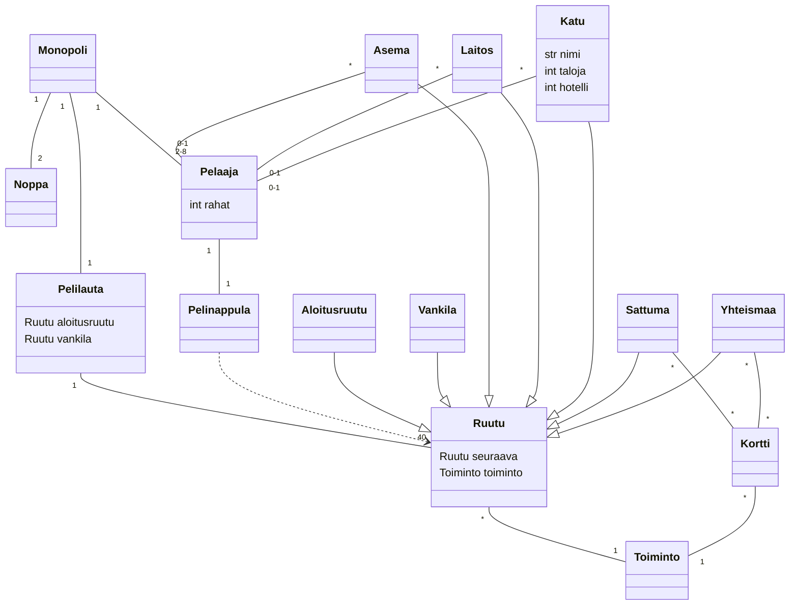

```mermaid
classDiagram
    class Monopoli
    class Noppa
    class Pelaaja {
        int rahat
    }
    class Pelilauta {
        Ruutu aloitusruutu
        Ruutu vankila
    }
    class Ruutu {
        Ruutu seuraava
        Toiminto toiminto
    }
    class Pelinappula

    class Aloitusruutu
    class Vankila
    class Sattuma
    class Yhteismaa
    class Asema
    class Laitos
    class Katu {
        str nimi
        int taloja
        int hotelli
    }
    class Toiminto
    class Kortti

    Monopoli "1" -- "2-8" Pelaaja
    Monopoli "1" -- "2" Noppa
    Monopoli "1" --  "1" Pelilauta
    Pelilauta "1" -- "40" Ruutu
    Pelaaja "1" -- "1" Pelinappula
    Pelinappula ..> Ruutu

    Aloitusruutu --|> Ruutu
    Vankila --|> Ruutu
    Asema --|> Ruutu
    Laitos --|> Ruutu
    Katu --|> Ruutu
    Sattuma --|> Ruutu
    Yhteismaa --|> Ruutu

    Ruutu "*" -- "1" Toiminto
    Sattuma "*" -- "*" Kortti
    Yhteismaa "*" -- "*" Kortti
    Kortti "*" -- "1" Toiminto
    Asema "*" -- "0-1" Pelaaja
    Laitos "*" -- "0-1" Pelaaja
    Katu "*" -- "0-1" Pelaaja
    
```